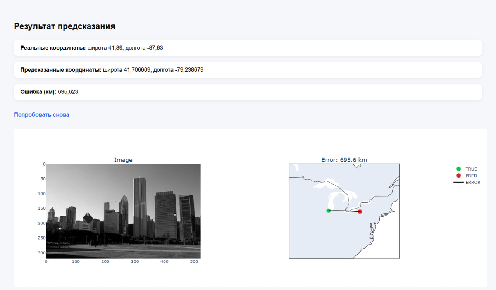

# Image Geolocation Predictor

Django веб-приложение, которое по загруженной фотографии предсказывает 
место, где она была сделана (широта и долгота), а также визуализирует 
результат на карте.

---

## Как работает

1. Пользователь загружает фото
2. Модель анализирует изображение
3. Предсказываются координаты (lat, lon)
4. Вычисляется ошибка (haversine distance)
5. Результат отображается:
   - изображение
   - карта с точками
   - метрика ошибки

---

## Технологии

- Python 3.10+
- Django
- PyTorch
- Pillow
- Plotly (визуализация)

---

## Установка

```bash
# 1. Клонировать репозиторий
git clone https://github.com/Watch-dog-s/Samsung_ML.git
cd Samsung_ML

# 2. Создать виртуальное окружение
python -m venv .venv
source .venv/bin/activate  # Linux / Mac
.venv\Scripts\activate     # Windows

# 3. Установить зависимости
pip install -r requirements.txt

# 4. Миграции
python manage.py migrate

# 5. Запуск сервера
python manage.py runserver
```

---

# Демонстрация
